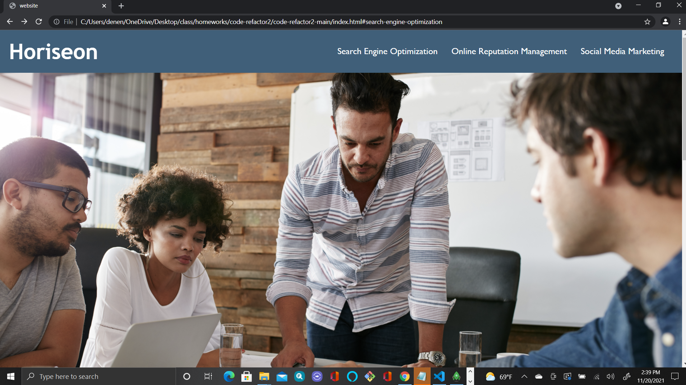

# Code-refactor2

## Description

* Code-refactor2 app reaches out to the world and expecailly people with disabilities, for example the hearing      impaired.  
* It allows users from desk tops to iphones direct accessibility and user freindly.

## Desktop

## Table of Contents

* [Stack](#stack)

* [Installation](#installation)
 
* [Deployment](#deployment)

* [Usage](#usage)

* [Questions](#questions)

* [Bugs](#bugs)

* [License](#license)

## Stack

The languages and libaries used in the application:

- CSS3
- HTML

## Installation

To install no necessery dependencies just follow the deployment url link.

## Deployment

* https://glewis67.github.io/code-refactor2/

## Usage

* The user want on a online store assceible to everyone, including a shopping cart set up on the web site.
* "Assistive technologies", for intance people with disabilities can use "video captions, screen readers, and braille keyboard"s. 
* A dymograhic freindly website is good for business by making the site more accessible for everyone it will be good business.
 

## Questions

For any questions regarding this application please reach out to: denen2@yahoo.com

## Bugs

Currently there are no bugs!

## License

This software is licensed under MIT license.

